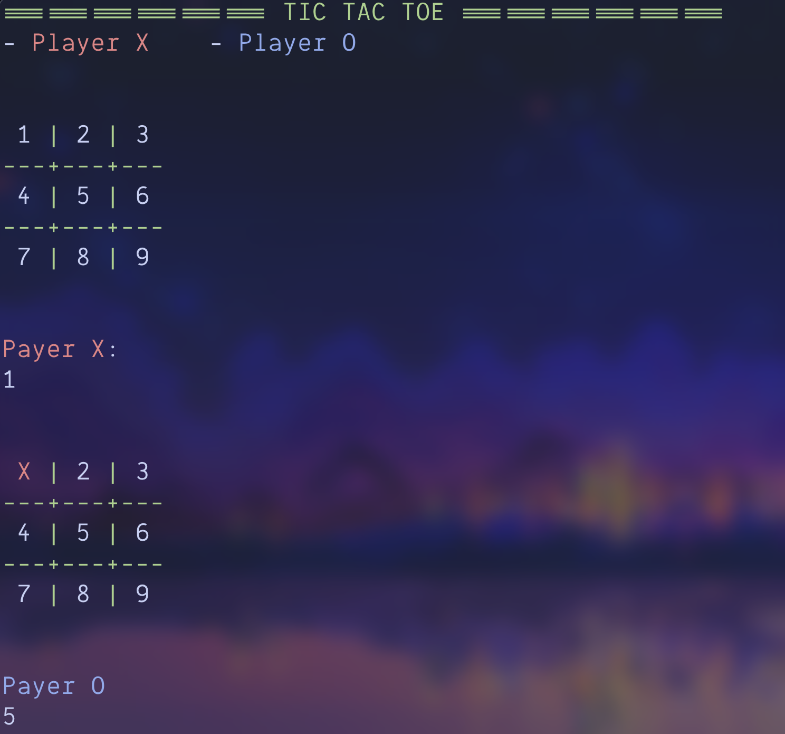

# Tic-Tac-Toe 

Un juego simple de consola de Tic-Tac-Toe implementado en Rust para demostrar conceptos fundamentales de programación concurrente, gestión de estado y manejo de errores (Result, ?).


## Requisitos y Ejecución

Este proyecto está escrito en **Rust** y requiere tener el entorno de desarrollo instalado.

### Requisitos

* **Rust Toolchain:** Se requiere la versión estable (Stable) de Rust. Puedes instalarla usando `rustup`.

### Ejecución

1.  **Clonar el repositorio:**
    ```bash
    git clone https://github.com/ErnestoAlns/tic-tac-toe
    cd tic-tac-toe
    ```

2.  **Compilar y ejecutar (modo desarrollo):**
    ```bash
    cargo run
    ```

3.  **Compilar para producción (optimizado):**
    ```bash
    cargo build --release
    ./target/release/tic-tac-toe
    ```

---

## Estructura y Características Clave

Este juego está diseñado de forma modular, separando claramente la lógica del juego (estado) de la lógica de I/O (interacción con el usuario).

### Componentes de Lógica

| Componente | Descripción | Conceptos de Rust |
| :--- | :--- | :--- |
| **`GameBoard`** | **Núcleo del juego.** Contiene el array `board: [[Cell; 3]; 3]`. | Struct, `impl`, Referencias mutables (`&mut self`). |
| **`fn play()`** | Implementa la lógica de la jugada, incluyendo la **validación de sobreescritura** y **validación de límites**. | Retorno de booleano (`bool`) para validar acción. |
| **`fn win_cheker()`** | Contiene las **8 formas de victoria** (filas, columnas y diagonales). | Lógica de control (`if/return`), `match` y `enum`s. |
| **`Cell` / `Turn`** | `enum's` para representar los estados de las casillas y los turnos. | `#[derive(PartialEq, Clone, Copy)]`, Patrón de alternancia. |

### Características

* **Alternancia de Turnos:** Manejada por el `enum Turn` y el método `next_turn()`.
* **Manejo de Errores:** La función `option()` utiliza el operador `?` para manejar errores de I/O (`read_line`) y de parseo (`parse()`).
* **Diseño Robusto:** El bucle principal utiliza un `while` que solo avanza el turno y el contador si la jugada fue válida, asegurando la integridad de los turnos.
* **Interfaz de Consola:** Uso de la librería `colored` para diferenciar visualmente a los jugadores X (rojo) y O (azul). 

---

## Uso

El jugador ingresa la posición de su jugada utilizando el **número del 1 al 9** que se muestra en el tablero (las posiciones van de arriba a abajo, de izquierda a derecha).
